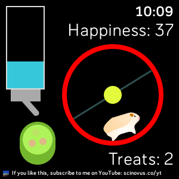
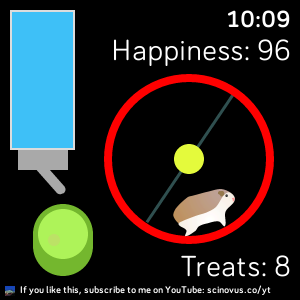

# Pet Hamster App

## About
I created this hamster app for fun. It is both free and compatible with the Versa, Versa 2, and Versa Lite. You used to be able to only watch the hamster run on the wheel in its cage, however, the most recent update brings some cool new features to make it into more of a game.

## Acknowledgments
This app was inspired by aBowman Hamster [Chrome extension](https://chromewebstore.google.com/detail/ab-hamster/jnpagnhcemblbjmaodhdeopdaoifdeag?hl=en-US). However, I have tweaked it a fair bit, as the extension has an interactive hamster, and my app is more of a static game.

## Usage
After you have installed this app (see below if needed), let the fun begin! The treat count is based on your step count, the water bottle is a battery level indicator, and the food pellets disappear based on your calories. These three things impact your hamster's happiness score, and your hamster is happier when it has eaten more food, has more treats, and has a full bottle of water. Depending on the happiness score, you can change the hamster's color to one of two or three options based on certain threshold values by tapping on it. At really high happiness levels, you can even change the color of the cage by tapping anywhere else. Additionally, there is a special happiness score that unlocks the rainbow hamster. Can you figure out how to get it?

## Installation
This app has been approved in the Fitbit Gallery. The easiest way to install it is to search it in the Fitbit app on your phone and press `Install`.  
Here is the link to it: https://gallery.fitbit.com/details/d3e4deb8-3de4-4dc6-9d4a-e6d7519a4fbd  
Alternatively, you can download this repository and sideload it yourself, but I would recommend against doing that.

## Bugs
If you find one, feel free to open up a new issue or even better, create a pull request fixing it. But then again, this app is extremely simple, so I don't expect for there to be any.

## Support
For support and FAQs, please check out my website [sagrawal8fitbit.dev](https://sagrawal8fitbit.dev).

## Author
I'm a self-taught programmer who knows many languages and I'm into app, game, and web development. If you would like to contact me, my email is [sagrawal8.fitbit.dev@gmail.com](mailto:sagrawal8.fitbit.dev@gmail.com?subject=Pet_Hamster_Github).

## License
This package is licensed under the [MIT License](LICENSE.txt).