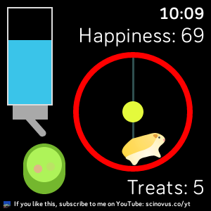

# Pet Hamster App

## About:
I created this hamster app for fun. It is both free and compatible with the Versa, Versa 2, and Versa Lite. Simply watch the hamster run on the wheel in his cage.

## Features:
- The level is based on your step count.
- The water bottle is a battery level indicator.
- The food pellets disappear based on your calories.
- The hamster has a lighter and darker coloring option.

## View:
https://gallery.fitbit.com/details/d3e4deb8-3de4-4dc6-9d4a-e6d7519a4fbd

## Contact
If you have any comments or suggestions, contact me via [Discord](https://discord.com/users/575795042933932071) or [email me](mailto:sagrawal8.fitbit.dev@gmail.com?subject=Pet_Hamster_Github).  
For support and FAQs, please check out my website: [sagrawal8fitbit.dev](https://sagrawal8fitbit.dev).  
If you like this app, consider subscribing to me on [YouTube](https://www.youtube.com/@ScinovusCrafted?sub_confirmation=1), where I post Minecraft content.
